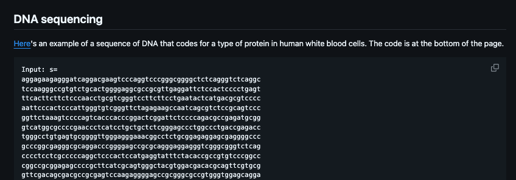
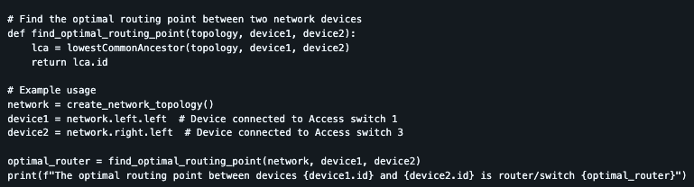

# LeetCode problems and their practical use cases
This project is an attempt to make coding problems more interesting by thinking of practical use cases for them. 

## Samples
>An example of using real data from NIH website :\

>Here is an attempt to understanding networking route :\
